<h1 align="center"> Ghost Team Website!, Call Of Duty Game </h1>
Ghost Team is a a real Team in Call of Duty Game, Germany. The Team has been a big part of Call of Duty World championships for many years, Also provides Most Valuable Players (MVPs) for all Call Of Duty events around the world.

The intent of the website is to provides valuable information about Call of Duty Game to all players and COD lovers around the world, And last but not least, push the most valuable players to join Ghost team.

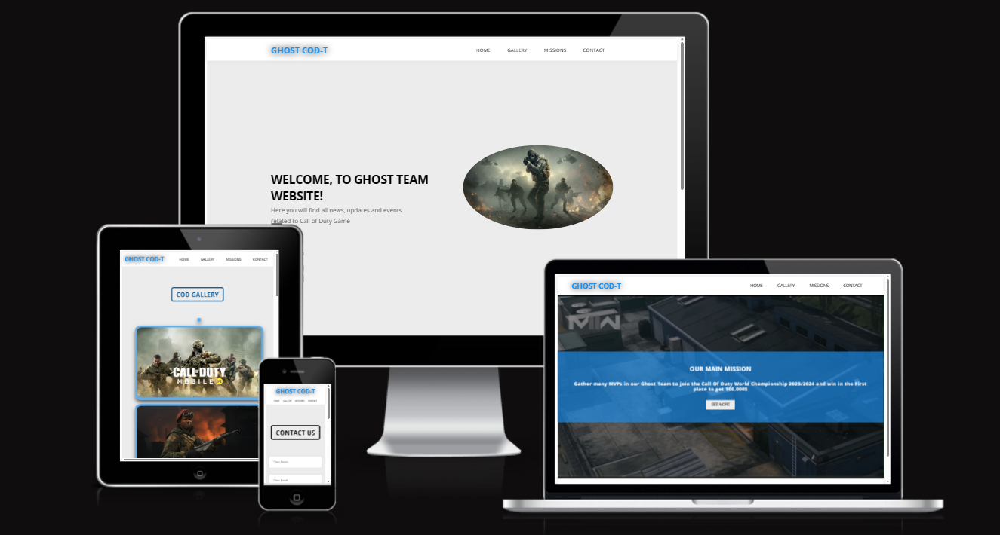

The Ghost Team site is live, the link to which can be found by [CLICK HERE](https://alakeldev.github.io/ghost-cod-team-website-pp1/)

## Tabel of Contents
- [Tabel of Contents](#tabel-of-contents)
- [UX](#ux)
  - [Site Purpose:](#site-purpose)
  - [Site Goal:](#site-goal)
  - [Audience:](#audience)
  - [Communication:](#communication)
  - [Current User Goals:](#current-user-goals)
  - [New User Goals:](#new-user-goals)
- [Design](#design)
  - [Colour Scheme:](#colour-scheme)
  - [Typography:](#typography)
  - [Imagery:](#imagery)
- [Features](#features)
  - [Existing Features](#existing-features)
    - [Navigation bar:](#navigation-bar)
    - [Landing Page:](#landing-page)
    - [Gallery Page:](#gallery-page)
    - [Missions Page:](#missions-page)
    - [Contact Page:](#contact-page)
    - [Footer and Social Links :](#footer-and-social-links-)
  - [Future Features:](#future-features)
- [Testing](#testing)
  - [Validator Testing](#validator-testing)
  - [Unfixed Bugs](#unfixed-bugs)
- [Technologies Used](#technologies-used)
  - [Main Languages Used](#main-languages-used)
  - [Frameworks, Libraries \& Programs Used](#frameworks-libraries--programs-used)
- [Deployment](#deployment)
  - [How to deploy](#how-to-deploy)
  - [How to clone](#how-to-clone)
- [Credits](#credits)
  - [Content](#content)
  - [Media](#media)
  - [Acknowledgements](#acknowledgements)

## UX

### Site Purpose:
To provide information about Call Of Duty Game, its events, updates, photos to everyone who is visiting the website, also push the most valuable players to join Ghost team that already has many Legendary titles.

### Site Goal:
To regularly update our current team members and also the vistors with the latest game information, also provide them with new updates and events of Call Of Duty game. We Keep users coming back to regularly check on this valuable information and later for asking to join Ghost team.

### Audience:
Everyone with a love to Call Of Duty game and wants to know all news about it, also willing to attend Call Of Duty events/championships to seek out winning and titles. Your target are all COD players/lovers (women & men) ages 18-35.

### Communication:
With a clear, animated and simple design, this information is readily available to all who visit the site. the user easy knows instantly where they are because of the good and clear website structure.As I mentioned the information is readily available, without having to go through an exhaustive search.

### Current User Goals:
- To check Call of Duty last updates, versions, upcoming events and championships, also asking to join Ghost team.

### New User Goals:
- To navigate the site with ease, animate design, simple & clearly understand the information that is being provided.
- For the information to be always relevant & up-to-date.
- To be inspired by a striking with animate design that captures my immediate interest, and keeps my focus on the site.

## Design

### Colour Scheme:
The colour palette was created by [Coolors](https://coolors.co) with the thought to provide as much contrast as possible, without feeling overwhelming. Most of the colour is primarily provided as a simple and calm across the site. However backgrounds were generated in two main colors ( calm gray, and white ) also the text has two main colors (black, sky calm blue) but some text has a one of gray degree color such as a paragraph in landing section and white color for the text inside missions page, also using black shadows with background white or even calm gray such as with photos section in gallery page. The combination of the background color and shadow color, does not overwhelm the user but give simple and stylish feeling. Also with a feature in navigation bar elements, when the cursor hover on each element, that will change the element color from black to calm blue with a very beatiful animation line will show above and below it to bring the users immediate attention to the fact that there is something there to be clicked.

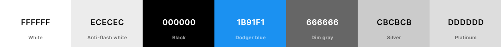

### Typography:
Open Sans was selected for the all Website pages as this font is a very famous, simple, readable and clear, also with manipulating between letters spacing and make it bold in some places make it looking great.

### Imagery:
All the imagery on the site, was sources from free gaming stock photo platforms. some photos in gallery section were readjust the brightness, exposure, contrast and shadows to make it more clear and modern to display it.

## Features

### Existing Features
#### Navigation bar:
This is included across all the four pages, and provides people with an easy reference to navigate between the 'Home', 'Gallery', 'Missions' & 'Contact' pages.

#### Landing Page:
This defines the feel of the website, providing the user with an animated image goes up and down, and beside this photo there are main title and text that they can easily associate to what the Website is & does.

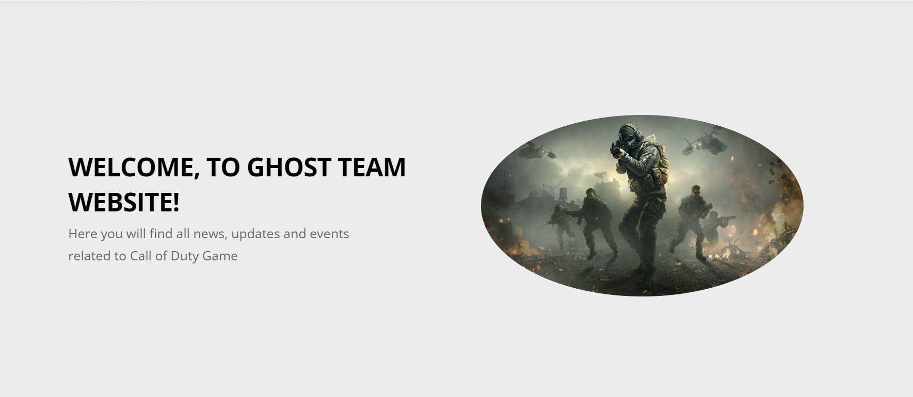

The upcoming events section is listed right beneath the landing section, its title has feautre of color changing between (black, sky calm blue) to make the visitor more excited. This section is to provide visitors with full information about Call of Duty events, and give important details such as locations, date/time, also other information to give possibility to the COD players and even normal vistor the early planning to attend, for each event has such a card and small arrow on it's footer, when the vistor hover the cursor on event's card the card will moving a littel bit up and the arrow on the card bottom the will start moving till the user move the cursor out of the card, these movings give the visitor good feeling and interact with events selection and if the visitor wants to see more details about the event, easly can click on read more.

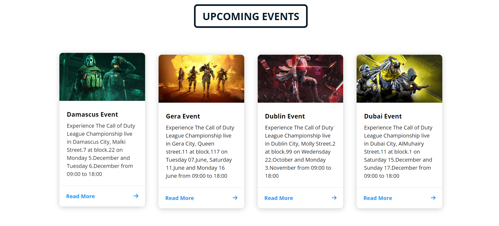

#### Gallery Page:
A big and color changing title has been installed at the top of the page, clearly reminding the users of the page's intent.

Next on this page is a Call of Duty photos with a creative decoration frame that changing it's colors and shows that the page are regularly updated with newest photos, as well as the small square decoration with color changing before first photo and after last photo. This start/end decorations will notify creativly the visitor that where the photos start and where will be end.

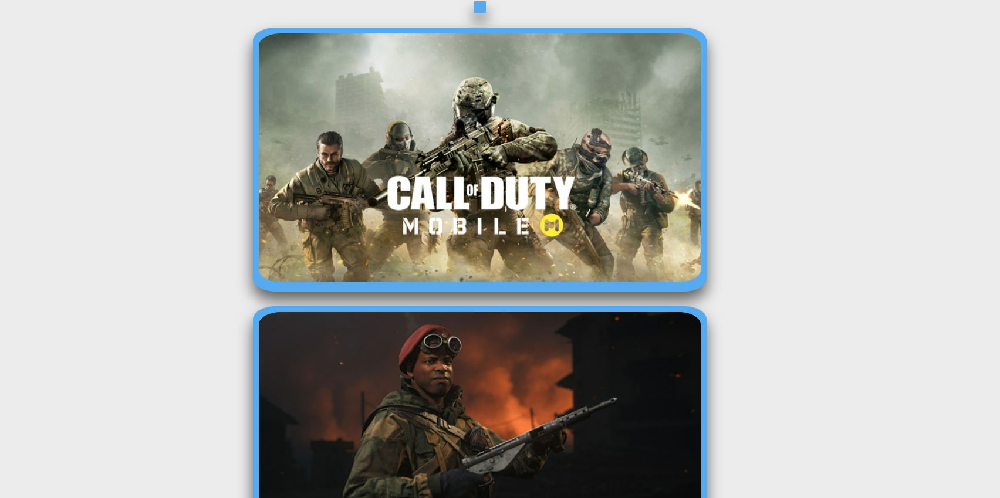

#### Missions Page:
In this page we have an auto play video for the last version of Call of Duty Game, and the video was covered with a top dark layer as a decoration to make the video more elegant and also the main purpose is to make the text content above the video more clear and readable without feeling overwhelming.

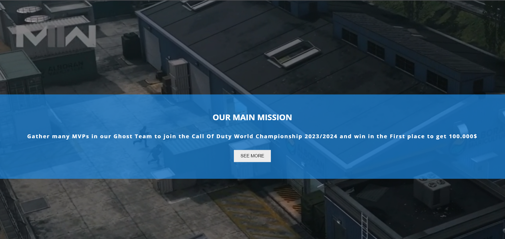

The top layer will be disappear in mobile version because the text content will be under the video not above it, and the user can watch the video and read the text below it without any blurred.

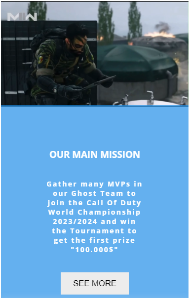

The text section coming with sky calm blue background color and white font to make the user easy to read without make any annoy or non comfort. also provide a button (See More) with simple square design and gray background to guid the user for an external page to show a list of all missions.

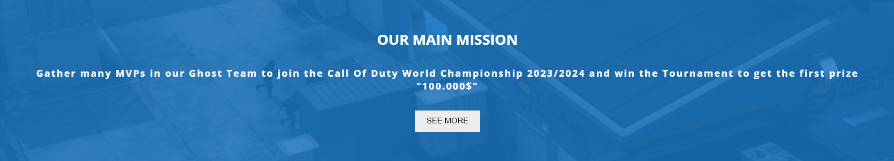

#### Contact Page:
A big and color changing title has been installed at the top of the page, clearly reminding the users of the page's intent.

Once again I have kept the design simplistic. in this page there is a form so that visitors can reach out to Ghost team direct and write their request or messeges, also beside the form provides some information about Ghost team office location with phone numbers so the visitor can call or visit the office direct.

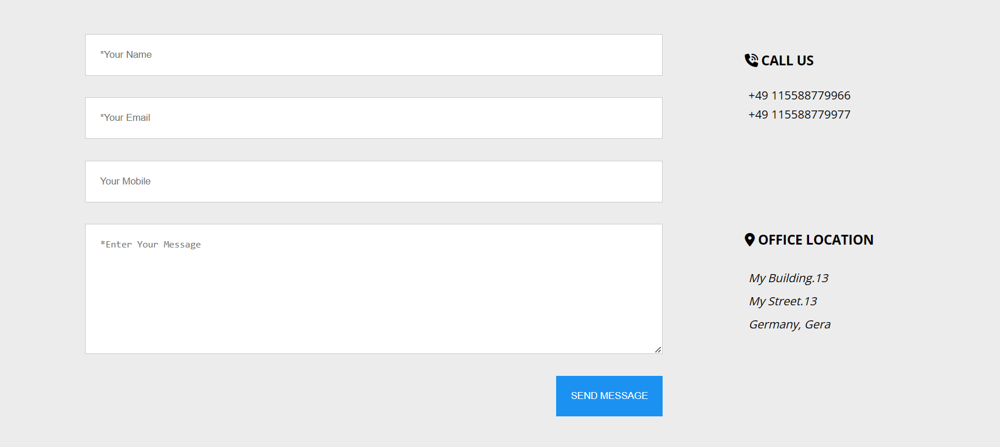

A 'form dump' page has also been included upon the instruction of my mentor Martina who informed me that it was necessary if a form was added to the project. The form-dump page appears as follows...

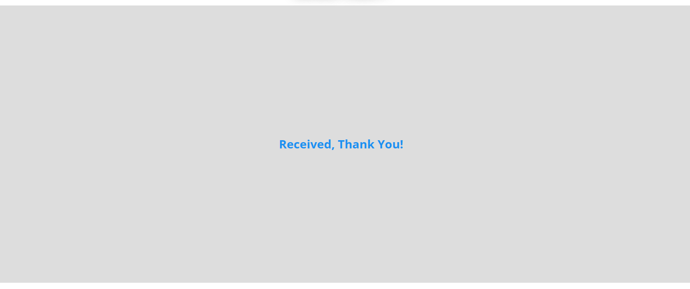

#### Footer and Social Links :
The Footer also has simplistic design and contain only links to Ghost team social media pages, and each one will take the user to the social media platform being references.

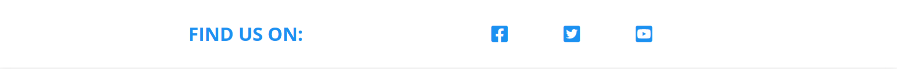

### Future Features:
- A map shows main live COD events/championhips locations in Europe.
- Page for Ghost team members that showing all achievements in details.
- A page for live broadcasts to all COD chammpionhips around the world.
- Live chatbot.

## Testing

### Validator Testing
- HTML (By using [W3C validator](https://validator.w3.org/))
  -  Result for index.html

     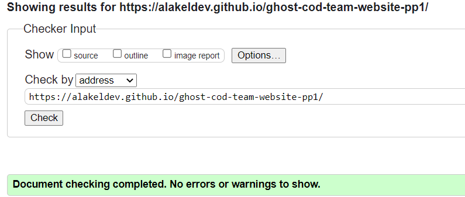
  -  Result for gallery.html

     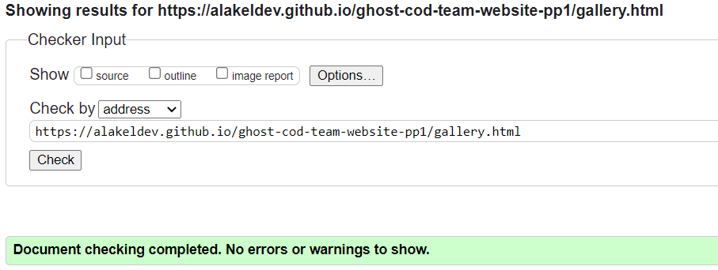
  -  Result for missions.html

     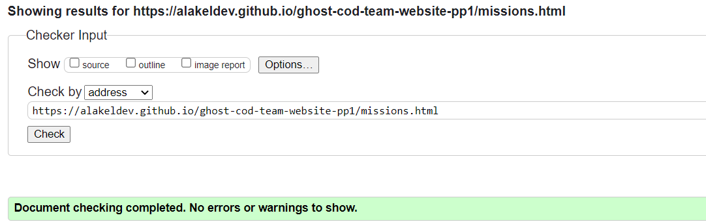
  -  Result for contact.html

     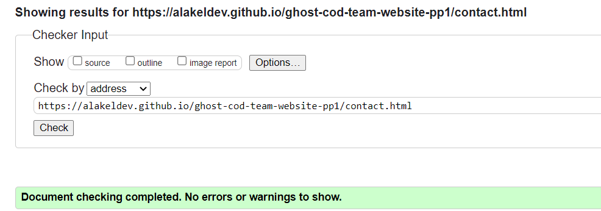
- CSS (By using [Jigsaw validator](https://jigsaw.w3.org/css-validator/))
  - Result for style.css

     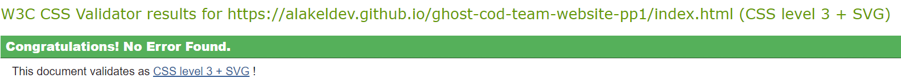
  - The Remaining warning mentioned that I have the same background color and foreground color 
      in Gallery page contexts "but it not make negative effect or conflicut with the user interaction".
     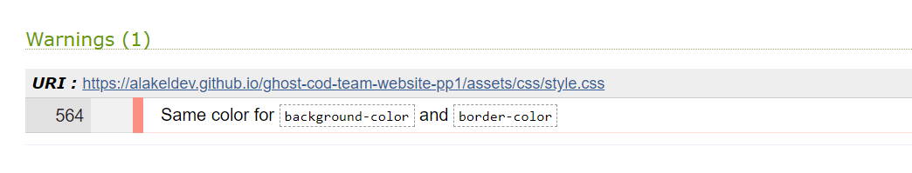
- Lighthouse Testing (By using the Lighthouse feature of Google Chrome's Developer Tools)
  - Result for index.html

     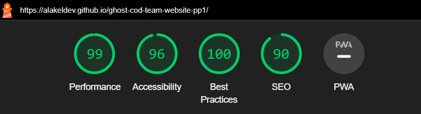
  - Result for gallery.html

     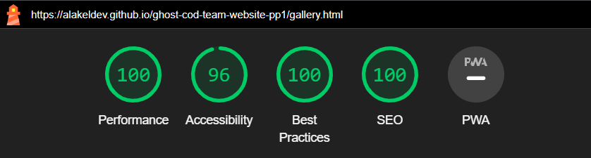
  - Result for missions.html

     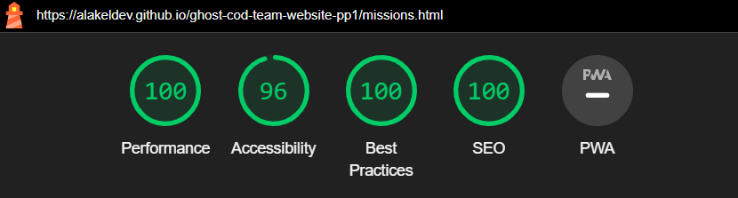
  - Result for contact.html

     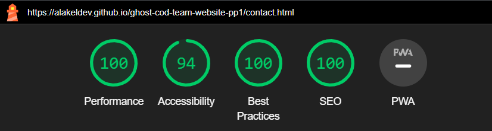

- Tested the site opens in MS edge, Chrome & Safari without issues.

- All links open to external tabes as intended.

### Unfixed Bugs

## Technologies Used
### Main Languages Used
- HTML5
- CSS3

### Frameworks, Libraries & Programs Used
- Google Fonts - for the font families: Open Sans. San-serif was used as a alt font.
- Coolors - to explore different colour schemes that best matched with animated COD gaming team website.
- Font Awesome - to add icons to the social links in the footer element and phone, pin location incons to Contact page.
- VS-Code - to creat my html files & styling sheet before pushing the project to Github.
- GitHub - to store my repository and deployed live link for submission.
- Balsamiq-wireframes - was used to create a basic structure of the home page before I start 
  initiate the project files & start to code.
- Am I Responsive? - to ensure the project looked good across all devices.
- Photo-movie-editor/Microsoft photos app - to readjust the video & images.

## Deployment
### How to deploy
- The site was deployed to GitHub pages. The steps to deploy are as follows:
- In the GitHub repository, navigate to the Settings tab
- From the source section drop-down menu, select the main Branch
- Once the main branch has been selected, the page will be automatically refreshed with a detailed ribbon display to indicate the successful deployment.
- The live link can be found [HERE - GHOST-COD-T](https://alakeldev.github.io/ghost-cod-team-website-pp1/)

 ### How to clone
- Go to the following repository on GitHub: https://github.com/alakeldev/ghost-cod-team-website-pp1
- At the top right of the screen, click the 'Code' button, and then click 'HTTPs'
- Copy the link in this field
- Open VS-code, creat new project folder, open the terminal
- On the terminal type "git clone", then paste the copied url and press 'Enter'
- The clone process should now begin

## Credits

### Content
- My knowledge of implementation is more advanced because of my of my bachelor degree in IT, the initial set up & style was set close to my worked with previous projects in my university which is also similar to the 'Love Running' walk-through project. From there, I took inspiration for the design of the navigation bar, landing section,,,, along with the display of the social links in the footer element.

- The styling of the form element in 'Love Running' was used beside my previouse experince as a starting point for my form, but I never follow the steps of float property to arrange the element places on webpage becuase float is complex and not flexy. So I used to work with flexbox and grid as more easy to control the elements on webpage.

- I follow my quote since my university study, that said when you start to build html page make sure to build a good structure with semantic elements and Div containers that will make you understand it very well and that will make for you more easy to initiate the correct properties to right targeted element.

- [W3Schools](https://www.w3schools.com/css/css3_mediaqueries.asp) website was used to remember some properites and the correct values range that I want to set in each property, so for me it's the main website after I finished from CSS and HTML curriculum on code-institute website as it helped me in many situations.

- Most of issues that faced were in Media rules so I follow the way that feel me comfort and well code structured so I set for every element and sometimes in each section it's own media rules then test it and show how it's behaviours with elements page after that I moved to another element or section.

- I used to read previouse posts on Slack Code-Institute Channels( PP1 / peer code review / my class channel too) these channels are showed old / previous issues that people faced with their code and some solutions provided from alumnis. these info and posts increase my knowledge because I love to read and search in Slack Channels even if i don't have issues with my website or code, because that will make me know more what others facing in their code, also sometimes I replied to them with my solution and see if I'm right or somebody will correct mine or provide another solution.

- I want to add small note that I played some online games that made me remember all the details/values inside flex and Grid properties with examples. These games are: [Mastery Games](https://mastery.games/post/flexboxzombies2/), [Grid Garden](https://cssgridgarden.com/), [Flex Froggy](https://flexboxfroggy.com/) and all very recommended to master these properties.

### Media
- Missions Video is From ["Call of Duty Youtube Video"](https://youtu.be/MbbDADY4GTA)

- The website images came from hdqwalls website, games section, Call of Duty game: [Call Of Duty Images](https://hdqwalls.com/call-of-duty-mobile-2019-wallpaper)

### Acknowledgements

- I want to say thank you to my mentor Martina, who consistently gave me good advices and helped me keep things in perspective throughout the project.